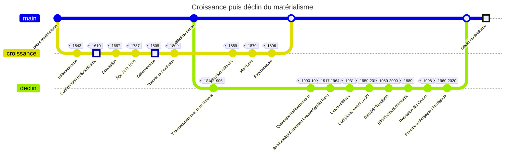

# L'aube d'une révolution
Il n'y a jamais eut autant de découvertes scientifiques bouleversantes ces derniers temps, surtout depuis le XXeme siècle.
Au point où des questions destinées à la philosophie a la base (comme l'origine de toutes choses) sont devenus des sujets scientifique.
## Le choc de découvertes révolutionnaires
Développée plus en détail dans cette note : [[1 - Choc découvertes révolutionnaires]]
## Confrontation entre la sciences et la foi
Développée plus en détail dans cette note : [[2 - Confrontation Science Foi]]
## Le crépuscule du matérialisme
Jusqu'au milieu du 20eme siècle, la raison humaine était basée sur :
- marxisme
- [[Freud|freudisme]]
- Scientisme

Cependant :
- Univers simple et déterministe :
  Idée contredites a cause du quantique et de l'indétermination
- Échec du marxisme :
  Abandon de cette idée par les asiatiques+ chute de l'URSS dans les années 1990
- Désillusion du [[Freud|freudisme]] :
  2005 "Le Livre noir de la psychanalyse" et tribune de 2019 rejettent les psychanalystes. Cependant, ils ont marqué la société occidentale :
    - éducation permissive
    - grandes libertés sexuelles

La chute de ces piliers ont mis en déroute le matérialisme surtout avec les découvertes cosmologiques mi-20eme siècle.

Même si le matérialisme est en fort déclin, le retour a la foi ne s'est cependant pas fait.
(Plus de détails plus tard dans le livre)
## Vérité entravée par les passions
Dès qu'un débat scientifique est en partie politisée, l'intelligence est affectée par les choix politiques, les intérêts personnels et passions. C'est donc un frein à la raison.

Celui qui en entraîne le plus cet effet est le débat a propos de l'existence de [[Dieu]]. Certaines personnes fuient le débat car elles veulent garder leur liberté, et donc de ne pas être soumises à un [[Dieu]].
Illustré par l'investissement conséquent par les USA a la recherche d'extra-terrestres (exemple : SETI) plutôt que l'hypothèse d'un [[Dieu]] :
> Savoir que les extra-terrestres existent ne changera rien, alors que savoir pour [[Dieu]] est un grand bouleversement

## Ce qui est prévue pour la suite de l'introduction
La prochaine partie de cette **Introduction du livre** explique le fonctionnement d'une preuve scientifique, pour appuyer la thèse de l'existence de [[Dieu]] et/ou son non existence.
### 1 - Les preuves les plus récentes
Chaque découverte cosmologiques cités précédemment dans cette note ainsi que le passage de l'inerte au vivant seront étudiés dans le livre.
### 2 - preuves extérieures au scientifique
Les preuves utilisant la raison mais n'étaient pas du domaine scientifique, c'est a dire la philosophie ou l'histoire, mais aussi les questions existentielles relevés de prêt ou de loin par l'existence de la [[Bible]] en elle même, seront étudiés.
### 3 - La fin des objections habituelles
Réponses aux très vieilles mais pourtant courantes objections face à l'existence de [[Dieu]].

# Fin de note
Retour sur la note général du livre : [[Dieu La Science les preuves]]
Suite du livre :